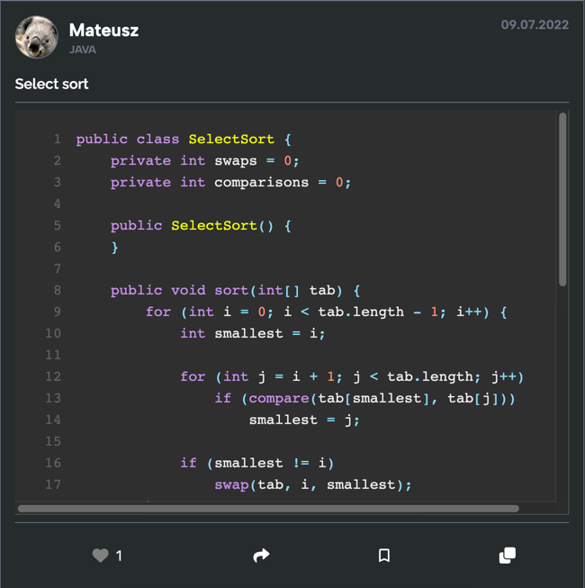
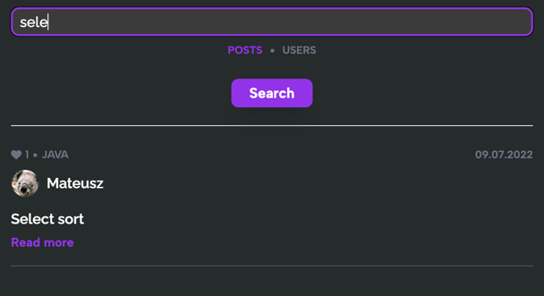

# Coding Blog
Try it in your browser -> [https://coding-blog-sand.vercel.app/](https://coding-blog-sand.vercel.app/)

### Description

Coding Blog is an application inspired by [Twitter](https://twitter.com), but every post must contain a code 
snippet.

-----------

<p align="center" width="100%">
    
</p>

-----------

User can browse through the blog posts and read them, give reactions, add the best posts to favorites, share 
link to post or even copy code directly from main [board](https://coding-blog-sand.vercel.app/board).\
Furthermore, every logged user can create a new post and share it with the world.

There is search feature powered by [MongoDB Atlas Search](https://www.mongodb.com/docs/atlas/atlas-search/). There 
is no need to scroll through the whole list of posts to find the code or user you are looking for. Just type the 
phrase and get the results!

-----------

<p align="center" width="100%">
    
</p>

-----------

Despite it's a frontend project it contains a sign in functionality provided via [NextAuth.js](https://nextauth.js.org/)
and all the business logic that makes it possible to store (and update) posts and users in 
database ([MongoDB](https://www.mongodb.com/)).

### Development Guide

```
git clone https://github.com/Ptaku09/coding-blog
npm install
npm run dev
```

Open [http://localhost:3000](http://localhost:3000) with your browser to see the result.

### Tech Stack

- [`Next.js`](https://nextjs.org/)
- [`TypeScript`](https://www.typescriptlang.org/)
- [`TailwindCSS`](https://tailwindcss.com/)
- [`MongoDB`](https://www.mongodb.com/)